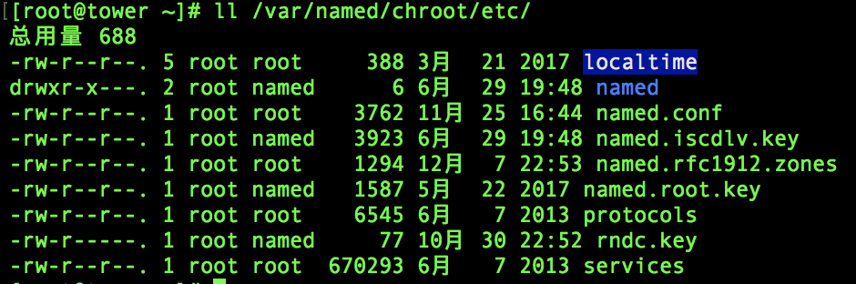
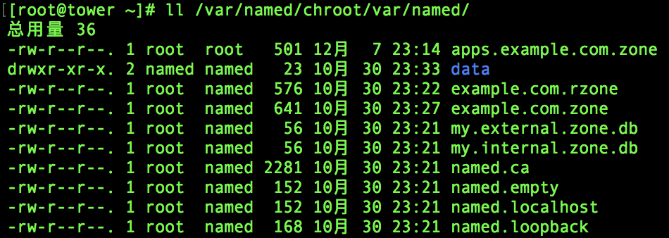

# 配置本地DNS服务器

|   项目   |   描述               |
|:-------:|-------------------|
|本文目的|本文描述在*Red Hat Enterprise Linux 7.4*（以下简称RHEL）上部署DNS服务的步骤。<br>也适用于RHEL 7的其他小版本以及类RHEL的Linux操作系统，例如*CentOS 7*。|
|安装版本|Red Hat Enterprise Linux 7.4|
|作者|刘洋 GitHub ID: kevein|

本文是一篇安装指引，目的并非用于讲解教学。故一些技术细节将不展开详细介绍，请读者见谅。
> 注：本文中的DNS服务不能与OpenShift Master在同一台服务器上，强烈建议使用OpenShift平台以外的机器。
# 1 安装材料

## 1.1 安装介质

本文中的DNS服务采用目前流行的[BIND9](https://en.wikipedia.org/wiki/BIND)软件，也是系统自带的软件包。
需要

- Red Hat Enterprise Linux 7.4 安装镜像（DVD）
- 或`rhel-7-server-rpms`频道软件包 

> 离线安装介质可以联系红帽工程师获取，或自行准备。

## 1.2 主机

### 1.2.1 主机配置要求

本文示例所使用的主机配置如下：

| 名称    | 域名             | CPU        | 内存  | 磁盘 | IP地址| 说明|
|--------|-----------------|-------------| -----| -----|------|----|
| DNS |ns.example.com<br>tower.example.com| 64 bit vCPU x 2 | 4 GB RAM  | 40 GB Disk |192.168.172.200|DNS服务器 |

DNS所在机器的配置可根据系统负载而定。
> 注：本环境中的DNS服务器与[Ansible Tower®️](https://www.ansible.com/products/tower)在同一台机器上。

## 1.2.2 系统要求

操作系统：<font color="red">Red Hat Enterprise Linux 7.4 Minimal</font>安装。

## 1.2.3 网络配置

确保DNS服务器防火墙开放`UDP:53`端口。

## 1.2.4 时间同步

DNS服务并不要求时间同步，但仍然建议网络内的所有机器使用NTP同步时间。

# 2 安装流程

RHEL7 上配置DNS服务的流程包含以下步骤：

- 一、安装Bind相关软件包
- 二、配置主域（本环境中为`.example.com`）
- 三、配置委派域（本环境中为`.apps.example.com`）
- 四、测试

# 3 软件安装与配置

参考[`openshift-3.7-1master-cn.md`](../openshift-3.7-1master-cn.md)文中配置YUM仓库服务的步骤，确保`rhel-7-server-rpms`频道可用。

## 3.1 安装软件
安装`bind`, `bind-utils`, `bind-chroot`软件。命令如下：
```	
[root@tower ~]# yum install -y bind bind-chroot bind-utils
```

安进入配置目录，并拷贝配置文件到该目录:
```
[root@tower ~]# cd /var/named/chroot/
[root@tower chroot]# cp -r /usr/share/doc/bind-9.9.4/sample/etc/* etc/
[root@tower chroot]# cp -r /usr/share/doc/bind-9.9.4/sample/var/* var/
```
启动named-chroot服务，并使之开机自启动。
```
[root@tower chroot]# systemctl start named-chroot
[root@tower chroot]# systemctl enable named-chroot
```

## 3.2 配置主域

1. 修改配置文件`named.conf`，加入可以访问该服务的网络地址，以及`forwarders`，用于转发本地无法解析的查询请求。
```
options
{
  ...忽略细节...
	listen-on port 53	{ any; }; 
	allow-query		{ any; }; 
	allow-query-cache	{ any; }; 

	recursion yes;
	forwarders {
		8.8.8.8;
	};

  ..忽略细节...
};

view "my_resolver"
{

	match-clients 		{ any; };
	recursion yes;

	zone "." IN {
	        type hint;
	        file "/var/named/named.ca";
	};
	forwarders {
		8.8.8.8;
	};

	include "/etc/named.rfc1912.zones";
};
```
以上内容为需要修改的内容。其中`forwarders`可以填写企业内部的DNS服务地址，用于解析网络内原有的域。
> 注：关于配置文件的详细内容，可以参考本项目中的配置文件样例：[`named.conf`](./conf/etc/named.conf)

2. 编辑配置文件`named.rfc1912.zones`，增加需要解析的域：

```
zone "example.com" IN {
        type master;
        file "example.com.zone";
        allow-update { none; };
};

zone "72.168.192.in-addr.arpa" IN {
        type master;
        file "example.com.rzone";
        allow-update { none; };
};
```
增加了 `.example.com` 域以及 `192.167.72.0 网段` 的反解析域。
> 注：关于配置文件的详细内容，可以参考本项目中的配置文件样例：[`named.rfc1912.zones`](./conf/etc/named.rfc1912.zones)

3. 创建解析文件。
进入 `/var/named/chroot/var/named` 目录，分别创建两个解析文件，内容如下：
```
[root@tower named]# cat example.com.zone 
$TTL    86400
@               IN SOA  example.com. . (
                                        42              ; serial (d. adams)
                                        3H              ; refresh
                                        15M             ; retry
                                        1W              ; expiry
                                        1D )            ; minimum
                IN NS           ns
ns       	IN A            127.0.0.1
master		IN A            192.168.172.201
node1		IN A            192.168.172.202
node2		IN A            192.168.172.203
tower		IN A            192.168.172.200
registry IN A          192.168.172.203 
yum      IN A           192.168.172.203

[root@tower named]# cat example.com.rzone 
$TTL    86400
@       IN      SOA     example.com. root.example.com.  (
                                      1997022700 ; Serial
                                      28800      ; Refresh
                                      14400      ; Retry
                                      3600000    ; Expire
                                      86400 )    ; Minimum
        IN      NS      ns.example.com.
200     IN      PTR     tower.example.com.
201     IN      PTR     master.example.com.
202     IN      PTR     node1.example.com.
203     IN      PTR     node2.example.com.
```

可根据实际情况修改解析文件的内容。

## 3.3 配置委派（Delegation）域

1. 编辑配置文件`named.rfc1912.zones`，增加需要解析的域：

```
zone "apps.example.com" IN {
        type master;
        file "apps.example.com.zone";
        allow-update { none; };
};

```
增加 `.apps.example.com` 域。

> 注：关于配置文件的详细内容，可以参考本项目中的配置文件样例：[`named.rfc1912.zones`](./conf/etc/named.rfc1912.zones)

2. 创建解析文件。
进入 `/var/named/chroot/var/named` 目录，创建解析文件，内容如下：
```
$TTL    86400
@               IN SOA  apps.example.com. . (
                                        42              ; serial (d. adams)
                                        3H              ; refresh
                                        15M             ; retry
                                        1W              ; expiry
                                        1D )            ; minimum
                IN NS           ns
ns       	IN A            127.0.0.1
*		IN A            192.168.72.202
```

这里将所有的 `.apps.example.com` 里的地址都解析为 `Node1` 的地址。读者可根据实际情况，将地址解析为OpenShift中Router的地址。

## 3.4 测试配置

确认以上内容都配置正确后，重启 `named-chroot` 服务。
```
[root@tower ~]# systemctl restart  named-chroot

```
服务启动后，配置 `/etc/resolv.conf` 文件，将DNS服务地址指向本文中配置的地址，即 `192.168.72.200`。</br>
执行命令验证：
```
[root@tower ~]# nslookup jenkins.apps.example.com
Server:		192.168.72.200
Address:	192.168.72.200#53

Name:	jenkins.apps.example.com
Address: 192.168.72.202

[root@tower ~]# nslookup master.example.com
Server:		192.168.72.200
Address:	192.168.72.200#53

Name:	master.example.com
Address: 192.168.72.201
```

配置完成。

# 4 故障处理
1. 最常见的问题是配置文件以及解析文件的权限问题，请参考下图中的权限设置：

**配置文件权限**
 
<!-- .element height="30%" width="30%" -->

**解析文件权限**
 
<!-- .element height="30%" width="30%" -->

2. 配置检查。使用如下命令可以检查配置文件与解析文件是否正确：
```
[root@tower ~]# named-checkconf /var/named/chroot/etc/named.rfc1912.zones 
[root@tower ~]# named-checkzone apps.example.com /var/named/chroot/var/named/apps.example.com.zone 
zone apps.example.com/IN: loaded serial 42
OK
```

